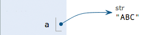
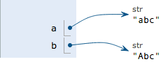

# Python学习笔记

## Day 1

### 整型与浮点型
- 整数和浮点数在计算机内部存储的方式是不同的，整数运算永远是精确的(包括除法)，而浮点数运算则可能会有四舍五入的误差。
- 十六进制整数前面加`0x`，例如`0xff00`等于`65280`。
- 浮点型可以表示科学计数法，例如`1.23e9`等于`1.23x10^9`。

### 布尔值
- 布尔值里只有`True`和`Fasle`。
- 布尔运算: 或`or`(全错才为错),且`and`(全对才为对)，非`not`(对错倒置)。
- Python把`0`、`空字符串`、`''`和`None`看成`False`，其他数值和`非空字符串`都看成`True`

### 空值
- 空值是Python里一个特殊的值，用None表示。None不能理解为0，因为0是有意义的，而None是一个特殊的空值。

### print
- 写法`print 'hello world'`或`print('hello world')`。
- Python2 里面print可以直接接字符串或者运算。Python3 里面print变成了一个函数，上面的写法不支持了，必须用一个括号括起来，否则会报告语法错误。 
- print会依次打印每个字符串，遇到逗号“,”会输出一个空格，然后将输出的字符串拼接起来。

### 注释
```
# 这一行全部都是注释...
print 'hello' # 这也是注释
```

## Day 2

### 变量
- 在Python程序中,变量是用一个变量名表示,变量名必须是大小写英文、数字和下划线`_`的组合，且不能用数字开头。
- 例：执行`a = 'ABC'`,解释器创建了字符串'ABC'和变量a,并把a指向'ABC'。<br/>
- 执行`b = a`,解释器创建了变量b,并把b指向a指向的字符串'ABC'。<br/>
- 执行`a = 'XYZ'`,解释器创建了字符串'XYZ',并把a的指向改为'XYZ',但b并没有更改。<br/>

### 定义字符串
- 字符串可以用`''`或者`""`括起来表示。
- 转义字符`\`,转义字符`\`不计入字符串的内容中。常用的转义字符有：`\n`表示换行;`\t`表示一个制表符;`\\`表示\字符本身。

### raw字符串、多行字符串和Unicode字符串
- raw 字符串，里面的字符不需要转义。用法`r'\(~_~)/ \(~_~)/'`，输出`\(~_~)/ \(~_~)/`
- 多行字符串，用法:

	```
	'''abcdefg
		abcdefg
		abcdefg'''
	```
	输出：

	```
	abcdefg
	abcdefg
	abcdefg
	```
- Unicode字符串用u'...'表示;
- 如果中文字符串在Python环境下遇到 UnicodeDecodeError，这是因为.py文件保存的格式有问题。可以在第一行添加注释`# -*- coding: utf-8 -*-`;
- 在最新的Python 3版本中，字符串是以Unicode编码的。
- 可以三者混合着用`ur''' ...'''`。

### 字符串方法
- Python提供了`ord()`函数获取字符的整数表示，`chr()`函数把编码转换为对应的字符。
- 要计算str包含多少个字符，可以用`len()`函数。

### 格式化
- 在Python中，采用的格式化方式和C语言是一致的，用%实现，举例如下：

	```
	>>> 'Hello, %s' % 'world'
	'Hello, world'
	>>> 'Hi, %s, you have $%d.' % ('Michael', 1000000)
	'Hi, Michael, you have $1000000.'
	```
- 常见的占位符有：`%d`整数;`%f`浮点数;`%s`字符串;`%x`十六进制整数。
- 格式化整数和浮点数还可以指定是否补0和整数与小数的位数：

	```
	>>> '%2d-%02d' % (3, 1)
	'3-01'
	>>> '%.2f' % 3.1415926
	'3.14'
	```
- 不太确定应该用什么，%s永远起作用，它会把任何数据类型转换为字符串。
- 有些时候，字符串里面的%是一个普通字符,这个时候需要转义，用`%%`来表示一个`%`。

## Day 3

### List
- Python内置的一种数据类型是列表：`list`。list是一种有序的集合，可以随时添加和删除其中的元素:`list = ['a','b','c']`
- 用`len()`可以获取list元素的个数:`len(list) >>> 3`
- 用索引来访问list中每一个位置的元素，记得索引是从`0`开始的:`list[0] >>> 'a'; list[1] >>> 'b'; `、`list[2] >>> 'c'`
- 当索引超出了范围时，Python会报一个IndexError错误，所以，要确保索引不要越界，记得最后一个元素的索引是`len(list) - 1`。如果要取最后一个元素，除了计算索引位置外，还可以用-1做索引，直接获取最后一个元素：`list[-1] >>> 'c'`
- list是一个可变的有序表，所以，可以往list中追加元素到末尾：`list.append('d');`、` list >>> ['a','b','c','d']`
- 也可以把元素插入到指定的位置，比如索引号为`1`的位置：`list.insert(1, 'e'); `、`list >>> ['a','e','b','c','d']`
- 要删除list末尾的元素，用`pop()`方法：`list.pop(); `、`list >>> ['a','e','b','c']`,pop()里面可以填参数，指定删除哪个元素，而且被删除的元素还会被保存出来`x = list.pop();`、` x >>> 'c'`
- 要把某个元素替换成别的元素，可以直接赋值给对应的索引位置：`list[1]='b', list >>> ['a','b','b','c']`
- list里面的元素的数据类型也可以不同,list元素也可以是另一个list：`list=['a','b','b','c',s]; s=[1,2,3];`、`list >>> ['a','b','b','c',[1,2,3]]; list[4][0] >>> 1`

### tuple
- 另一种有序列表叫元组：tuple。tuple和list非常类似，但是tuple一旦初始化就不能修改:`t = (1, 2)`
- 定义一个只有1个元素的tuple，如果你这么定义：`t = (1)`,那么`t >>> 1`。这样不是tuple，是`1`这个数！这是因为括号`()`既可以表示tuple，又可以表示数学公式中的小括号，这就产生了歧义，因此，Python规定，这种情况下，按小括号进行计算，计算结果自然是`1`。所以，只有1个元素的tuple定义时必须加一个逗号`,`，来消除歧义：`t = (1,)`

### “可变的”tuple
- `t = ('a', 'b', ['A', 'B']); t[2][0] = 'X';t[2][1] = 'Y'`、`t >>> ('a', 'b', ['X', 'Y'])`
- 这个tuple定义的时候有3个元素，分别是`'a'`，`'b'`和一个`list`。<br/><br/>当我们把list的元素'A'和'B'修改为'X'和'Y'后，tuple变为：<br/>
- tuple的元素确实变了，但其实变的不是tuple的元素，而是list的元素。所以，tuple所谓的“不变”是说，tuple的每个元素，指向永远不变。

## Day 4
### 缩进规则
- Python严格要求4个空格，不要使用Tab，更不要混合Tab和空格。

### 条件判断
- 如果`if`语句判断是`True`,就把缩进的代码块执行。条件判断后的冒号不能少。
	
	```
	if <条件判断1>:
	    <执行1>
	elif <条件判断2>:
	    < 执行2>
	elif <条件判断3>:
	    <执行3>
	else:
	    <执行4>
	```
- `if`语句执行有个特点，它是从上往下判断，如果在某个判断上是`True`，把该判断对应的语句执行后，就忽略掉剩下的`elif`和`else`
- if判断条件还可以简写，比如写：

	```
	if x:
	    print('True')
	```
只要`x`是非零数值、非空字符串、非空list等，就判断为`True`，否则为`False`。

- input()
	- `input()`是用来读取用户的输入的。
	
	```
	birth = input('birth: ')
	if birth < 2000:
	    print('00前')
	else:
	    print('00后')
	```
	- 但是上面的代码输入一个数后会报错，因为input()返回的数据类型是str，str不能直接和整数比较，必须先把str转换成整数。Python提供了int()函数来完成这件事情：

	```
	s = input('birth: ')
	birth = int(s)
	if birth < 2000:
	    print('00前')
	else:
	    print('00后')
	
	```
	- 但是，如果输入`abc`呢？又会得到一个错误信息,`int()`函数发现一个字符串并不是合法的数字时就会报错，程序就退出了。

##### 循环
- Python的循环有两种，一种是`for...in`循环，依次把`list`或`tuple`中的每个元素迭代出来:

	```
	names = ['Michael', 'Bob', 'Tracy']
	for name in names:
	    print(name) 
	```
	执行这段代码，会依次打印names的每一个元素。
- `range()`函数: 可以生成一个整数序列，再通过`list()`或`tuple()`函数可以转换为`list`或`tuple`。

	```
	sum = 0
	for x in range(101):
	    sum = sum + x
	print(sum)
	```
- 第二种循环是`while`循环，只要条件满足，就不断循环，条件不满足时退出循环。计算100以内所有奇数之和，可以用`while`循环实现：

	```
	sum = 0
	n = 99
	while n > 0:
    	sum = sum + n
    	n = n - 2
	print(sum)
	```
	在循环内部变量`n`不断自减，直到变为`-1`时，不再满足`while`条件，循环退出。
- `break`退出循环:用for 循环或者 while 循环时，如果要在循环体内直接退出循环，可以使用 break 语句
-  `continue`跳过本次循环:在循环过程中，可以用break退出当前循环，还可以用continue跳过后续循环代码，继续下一次循环。
## Day 5
### dict
- Python内置了字典：dict的支持，dict全称dictionary，在其他语言中也称为map,使用键-值（key-value）存储，具有极快的查找速度。

	```
	>>> d = {'Michael': 95, 'Bob': 75, 'Tracy': 85}
	>>> d['Michael']
	95
	```
- `dict`的实现原理和查字典是一样的。假设字典包含了1万个汉字，我们要查某一个字，一个办法是把字典从第一页往后翻，直到找到我们想要的字为止，这种方法就是在`list`中查找元素的方法，`list`越大，查找越慢。
- 第二种方法是先在字典的索引表里（比如部首表）查这个字对应的页码，然后直接翻到该页，找到这个字。无论找哪个字，这种查找速度都非常快，不会随着字典大小的增加而变慢。
- `dict`就是第二种实现方式，给定一个名字，比如`'Michael'`，dict在内部就可以直接计算出`Michael`对应的存放成绩的“页码”，也就是`95`这个数字存放的内存地址，直接取出来，所以速度非常快。
- 把数据放入`dict`的方法，除了初始化时指定外，还可以通过`key`放入。一个`key`只能对应一个`value`，所以，多次对一个`key`放入`value`，后面的值会把前面的值冲掉：

	```
	>>> d['Jack'] = 90
	>>> d['Jack']
	90
	>>> d['Jack'] = 88
	>>> d['Jack']
	88
	```
- 如果`key`不存在，`dict`就会报错,要避免`key`不存在的错误，有两种办法，一是通过`in`判断`key`是否存在

	```
	>>> 'Thomas' in d
	False
	```
- 二是通过`dict`提供的`get`方法，如果`key`不存在，可以返回`None`，或者自己指定的`value`,就是后面这个参数填了后，如果`key`存在，就返回`key`的`value`,没有就返回那个参数。注意：返回`None`的时候`Python`的交互式命令行不显示结果。
	
	```
	>>> d.get('Thomas')
	>>> d.get('Thomas', -1)
	-1
	```
- 要删除一个`key`，用`pop(key)`方法，对应的`value`也会从`dict`中删除。

	```
	>>> d.pop('Bob')
	75
	>>> d
	{'Michael': 95, 'Tracy': 85}
	```
- 遍历`dict`可以用`for...in`循环。

	```
	for key in d:
		print(key,d[key]);
	```
- `dict`内部存放的顺序和`key`放入的顺序是没有关系的。
- 和list比较，dict有以下几个特点：
	- 查找和插入的速度极快，不会随着key的增加而变慢；
	- 需要占用大量的内存，内存浪费多。
- 而list相反：
	- 查找和插入的时间随着元素的增加而增加；
	- 占用空间小，浪费内存很少。

- `dict`可以用在需要高速查找的很多地方，在`Python`代码中几乎无处不在，正确使用`dict`非常重要，需要牢记的第一条就是`dict`的`key`必须是不可变对象。`字符串`、`整数`等都是不可变的，因此，可以放心地作为`key`。而`list`是可变的，就不能作为`key`。

### set
- `set`持有一系列元素，这一点和`list`很像，但是`set`的元素没有重复，而且是无序的，这点和`dict`的`key`很像。创建`set`的方式是调用`set()`并传入一个`list`,`list`的元素将作为`set`的元素：

	```
	>>> s = set(['A', 'B', 'C', 'C'])
	>>> print s
	set(['A', 'C', 'B'])
	>>> len(s)
	3
	```
- 由于`set`存储的是无序集合，所以我们没法通过索引来访问。访问 set中的某个元素实际上就是判断一个元素是否在`set`中。可以用`in`操作符判断。
- `set`的内部结构和`dict`很像，唯一区别是不存储`value`，因此，判断一个元素是否在`set`中速度很快。`set`存储的元素和`dict`的`key`类似，必须是不变对象，因此，任何可变对象是不能放入`set`中的。最后，`set`存储的元素也是没有顺序的。
- `set`的这些特点，可以应用在哪些地方呢？星期一到星期日可以用字符串`'MON', 'TUE', ... 'SUN'`表示。假设我们让用户输入星期一至星期日的某天，如何判断用户的输入是否是一个有效的星期呢？
	- 可以用 if 语句判断，但这样做非常繁琐：
	
		```
		x = '???' # 用户输入的字符串
		if x!= 'MON' and x!= 'TUE' and x!= 'WED' ... and x!= 'SUN':
		    print 'input error'
		else:
		    print 'input ok'
		```
	- 如果事先创建好一个`set`，包含`'MON' ~ 'SUN'`：

	```
	weekdays = set(['MON', 'TUE', 'WED', 'THU', 'FRI', 'SAT', 'SUN'])
	```
	再判断输入是否有效，只需要判断该字符串是否在set中：
	
	```
	x = '???' # 用户输入的字符串
	if x in weekdays:
	    print 'input ok'
	else:
	    print 'input error'
	```
- 由于`set`也是一个集合，所以，遍历`set`和遍历`list`类似，都可以通过`for`循环实现。直接使用`for`循环可以遍历`set`的元素
- 通过`add(key)`方法可以添加元素到`set`中，可以重复添加，但不会有效果。
- 通过`remove(key)`方法可以删除元素。
- `set`可以看成数学意义上的无序和无重复元素的集合，因此，两个`set`可以利用`|`和`&`做数学意义上的交集、并集等操作。
### 不可变对象
- `str`是不变对象，而`list`是可变对象。对于可变对象，比如`list`，对`list`进行操作，`list`内部的内容是会变化的。
- 而对于不可变对象，比如`str`，对`str`进行操作呢：

	```
	>>> a = 'abc'
	>>> a.replace('a', 'A')
	'Abc'
	>>> a
	'abc'
	```
- 虽然字符串有个`replace()`方法，也确实变出了`'Abc'`，但变量a最后仍是`'abc'`:

	```
	>>> a = 'abc'
	>>> b = a.replace('a', 'A')
	>>> b
	'Abc'
	>>> a
	'abc'
	```
- 要始终牢记的是，`a`是变量，而`'abc'`才是字符串对象！有些时候，我们经常说，对象`a`的内容是`'abc'`，但其实是指，`a`本身是一个变量，它指向的对象的内容才是`'abc'`：<br/>
- 当我们调用`a.replace('a', 'A')`时，实际上调用方法`replace`是作用在字符串对象`'abc'`上的，而这个方法虽然名字叫`replace`，但却没有改变字符串`'abc'`的内容。相反，`replace`方法创建了一个新字符串`'Abc'`并返回，如果我们用变量`b`指向该新字符串，就容易理解了，变量`a`仍指向原有的字符串`'abc'`，但变量b却指向新字符串`'Abc'`了：<br/>
- 所以，对于不变对象来说，调用对象自身的任意方法，也不会改变该对象自身的内容。相反，这些方法会创建新的对象并返回，这样，就保证了不可变对象本身永远是不可变的。


